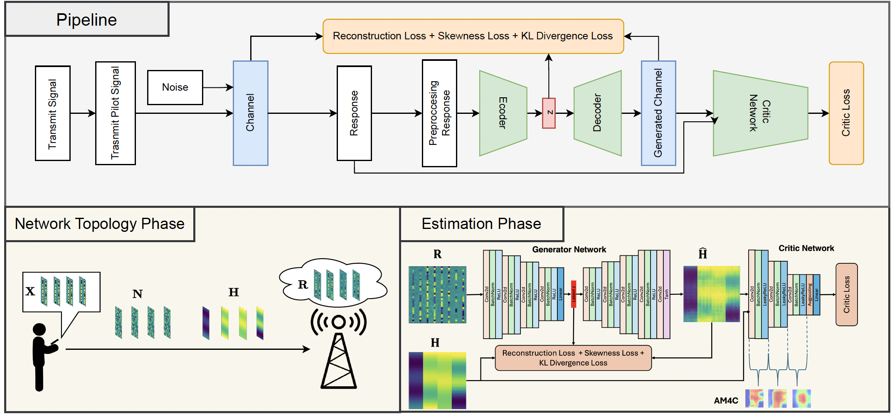
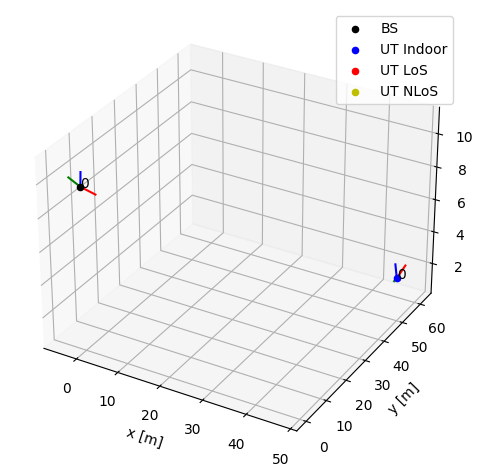

# Generative and Explainable AI for High-Dimensional Channel Estimation
**Nghia Thinh Nguyen and Tri Nhu Do**  
_International Conference on Communications (ICC)_  
Montreal, Canada  
2025  

## Abstract
In this paper, we propose a novel adversarial training framework for high-dimensional instantaneous channel estimation in wireless communications. Specifically, we train a generative adversarial network to predict channel realizations in the time-frequency-space domain. The generator incorporates the third-order moment of the input in its loss function and employs a new reparameterization method for latent distribution learning, aiming to minimize the Wasserstein distance between true and estimated channel distributions.

Furthermore, we introduce an explainable artificial intelligence mechanism to analyze how the critic differentiates the generated channels. Our results demonstrate that the proposed framework outperforms existing methods in minimizing estimation errors. Additionally, we observe that the critic primarily focuses on the high-power regions of the channel’s time-frequency representation.

### Paper
- [Accepted version](./Nguyen_Do_ICC_2025_accepted_version.pdf)
- Preprint ArXiv version (to be updated)

## GE-AI-HDCE




### Install 
#### Prerequistes
To run the code, make sure you already install `conda` enviroment
#### Setup
```
conda create python=3.10 -n ge_ai_hdce 
conda activate ge_ai_hdce

pip install -r requirements.txt

export PYTHONPATH=`pwd`
```

#### Dataset

Our dataset is simulated from [sionna](https://nvlabs.github.io/sionna/index.html) code.

We consider a uplink system, with topology as the image below



To get transmit signals, channel, response signals, run this code
```
python  src/data/get_data.py
```

To be clear about the simulate the dataset, we can run the notebook `./notebooks/Synthesys_Data_Multiple_Antenna.ipynb`


#### Training 

We consider `GAN` and `VAE` model for the system

To training the `GAN` model
```
python inter/train_gan.py
```
To training the `VAE-proposal` model
```
python inter/train_vae.py
``` 
The results of the training will be saved at `./results`

You can run the notebook in training phase at `./notebook/Gan-channel-est-multiple-antenna-baseline.ipynb` or `./notebooks/Vae-channel-est-multiple-antenna-proposed.ipynb`

#### Testing

To testing the `GAN` model
```
python infer/test_gan.py
```

To testing the `VAE` model
```
python infer/test_vae.py
```

You can run the notebook in testing phase at `notebooks/Test_Channel_Estimation_VAE_Multiple_Antenna.ipynb`


